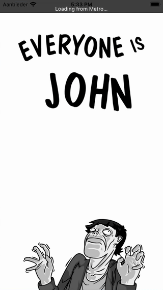

# Everyone is John

A mobile application built with React Native for [the roleplaying game with the same name](https://rpggeek.com/rpgitem/123829/everyone-john).



## Local development

### Prerequisites

Follow [React Native's CLI setup](https://reactnative.dev/docs/environment-setup)

### Start the Metro Server

```bash
npm start
```

Then you can select a type of device or simulator you would like to run it on.

### E2E tests

To run E2E tests you need to install [Maestro CLI](https://maestro.mobile.dev/) and necessary prerequisites for the platform you want to run E2E tests on.

Once done you can run either tests on iOS simulator:

```bash
npm run test:e2e:ios
```

Or on Android:

```bash
npm run test:e2e:android
```

Alternatively, you can launch application on a specific simulator with Metro server and run all/specific E2E tests by invoking Maestro CLI directly:

```bash
maestro test e2e/flows/[specific-flow]
```

This is especially handy during development.

## License

MIT © Konstantin Azizov
